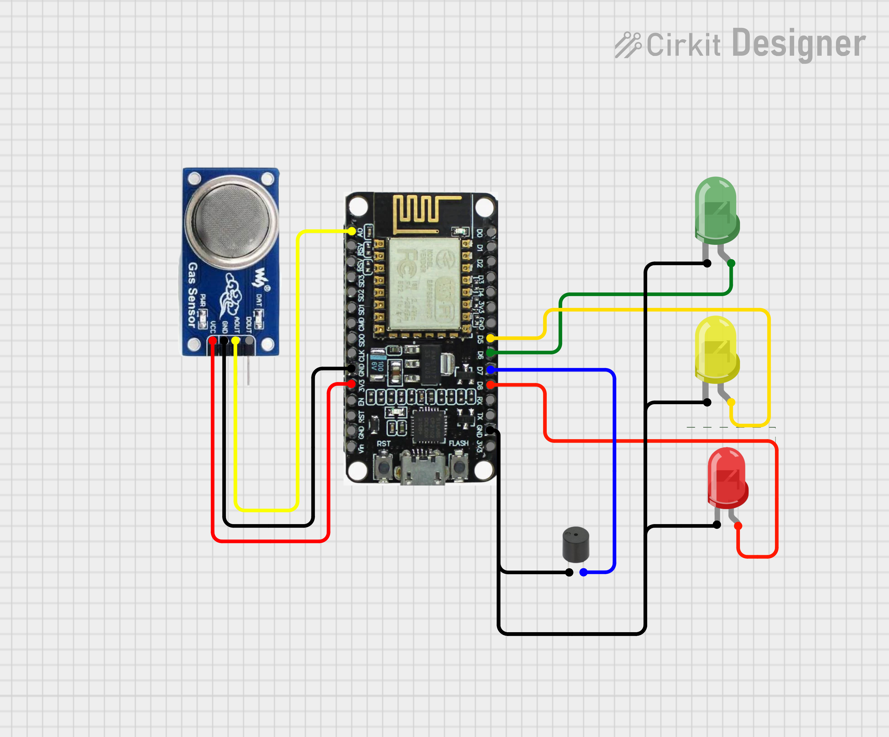

<h1 align="center">Nein-Smoker</h1>

<p align="center"><strong>Edge smoke and air-quality status monitor with local AP dashboard and multi-tier alerting.</strong></p>

## Overview

Nein-Smoker is a hybrid IoT edge computing prototype with an ESP8266 and MQ135 sensor. It computes corrected gas concentration and maps results into safety states, providing local alerts and a standalone access-point dashboard.


## Key Features

- Corrected PPM air-quality computation from MQ135 sensor data
- Three-tier alarm model: SAFE, WARNING, DEATH
- Local LED and buzzer signaling for fast condition awareness
- Embedded access-point dashboard for direct monitoring
- Modular sketches for hardware-only and web-enabled operation
- Serial logging for test and calibration

## System Architecture



1. MQ135 measures ambient gas concentration.
2. ESP8266 applies temperature/humidity correction.
3. Firmware classifies readings into discrete states.
4. LEDs/buzzer provide immediate local alerts.
5. `main-v1-web` hosts a dashboard at `http://192.168.4.1`.

## Hardware / Software Stack

- Hardware:
  - ESP8266-compatible module
  - MQ135 gas sensor
  - Status LEDs and passive buzzer
- Software:
  - Arduino core for ESP8266
  - `ESP8266WiFi`, `ESP8266WebServer`
  - `MQ135` sensor library
  - Sketches: `main-v1`, `main-v1-web`, `test-sensor`

## Installation & Setup

1. Clone the repository.
2. Open the target Arduino sketch:
   - `main-v1/main-v1.ino` for local alarm signaling
   - `main-v1-web/main-v1-web.ino` for AP-hosted monitoring
   - `test-sensor/test-sensor.ino` for sensor diagnostics
3. Install required libraries in the Arduino IDE.
4. Select the ESP8266 board and correct COM port.
5. Upload the firmware.
6. For `main-v1-web`, connect to SSID `Nein-Smoker` and open `http://192.168.4.1`.

## Usage / Operation Flow

- Device boots and initializes the MQ135 sensor and outputs.
- Every 500 ms, the firmware updates corrected PPM and condition state.
- Output behavior by state:
  - SAFE: green LED on, no buzzer
  - WARNING: yellow LED blinks, buzzer pulses
  - DEATH: red LED blinks faster, buzzer pulses faster
- Web mode provides a local gauge and status palette on the dashboard.

## Results / Output

- Real-time corrected PPM monitoring
- Discrete safety alerts for elevated gas readings
- Standalone AP dashboard accessible at `http://192.168.4.1`

## Schematic Diagram

```
         +----------------+
         |    MQ135       |
         |  Gas Sensor    |
         +--------+-------+
                  |
               A0 |  Analog
                  |
         +--------v-------+
         |  ESP8266       |
         |  Module        |
         +--+---+---+---+-+
            |   |   |   |
        GPIO12 GPIO14 GPIO15 GPIO13
          |      |      |      |
      [SAFE] [WARN] [DEATH] [BUZZER]

         +-------------------------+
         |  ESP8266 AP Mode        |
         |  SSID: Nein-Smoker      |
         |  Address: 192.168.4.1   |
         +-------------------------+
```

## Project Structure

```
Nein-Smoker/
  README.md
  main-v1/
    main-v1.ino
  main-v1-web/
    main-v1-web.ino
  test-sensor/
    test-sensor.ino
```

## Future Improvements

- Add DHT22/BME280 temperature and humidity sensing for dynamic correction
- Persist readings and alarms through MQTT or local storage
- Calibrate thresholds using reference data
- Add OTA firmware update support for field deployments


## References

- MQ135 sensor and library documentation: https://github.com/GeorgK/MQ135
- MQ135 datasheet: https://www.olimex.com/Products/Components/Sensors/SNS-MQ135/resources/SNS-MQ135.pdf
- ESP8266 Arduino core documentation: https://arduino-esp8266.readthedocs.io/en/latest/
- `ESP8266WiFi` / `ESP8266WebServer` API references: https://arduino-esp8266.readthedocs.io/en/latest/esp8266wifi.html

---
<p align="center"> Curated by .Bex 7386 Mini-Techlab </strong></p>
